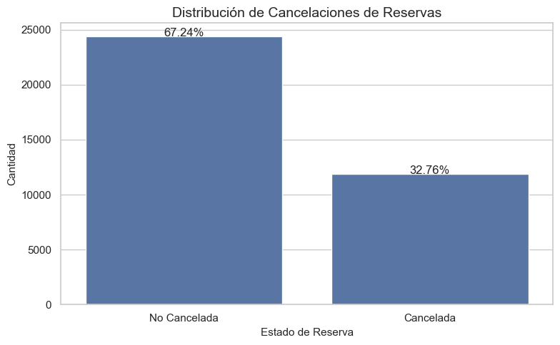
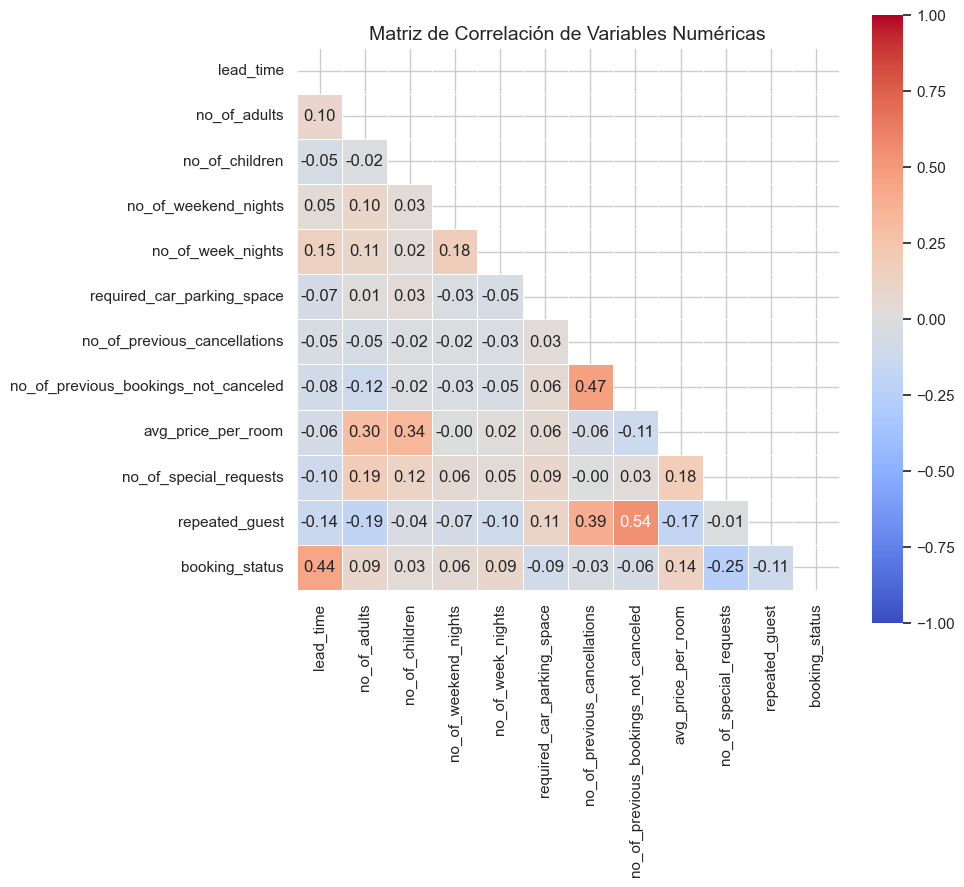
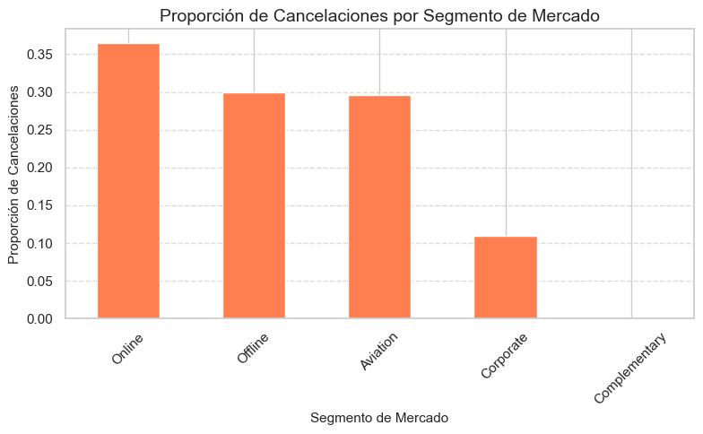
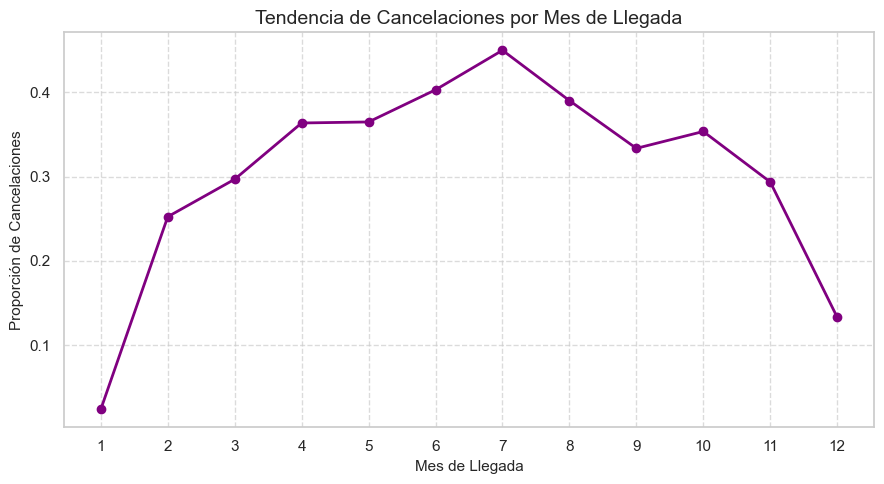
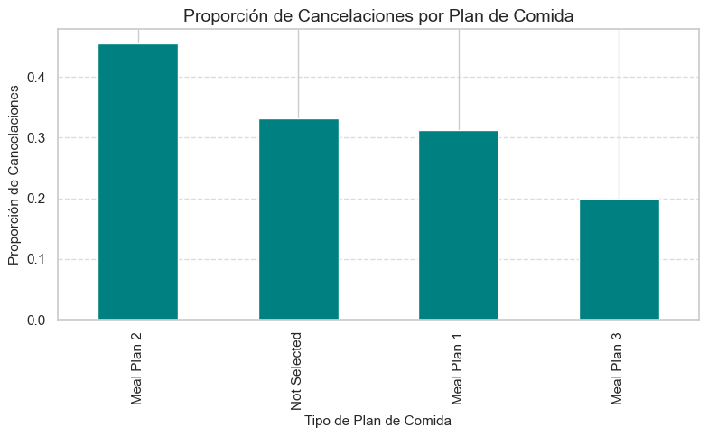

# Modelo de clasificación para la prediccion de cancelaciones de reservas de hotel

## Pregunta de investigación
¿Es posible predecir la cancelación de una reserva de hotel basándose en las
características de la reserva y del cliente?

### Objetivo General
Desarrollar un modelo predictivo que estime la probabilidad de cancelación de una
reserva de hotel.

### Objetivos Específicos

- Realizar un análisis exploratorio de los datos para identificar patrones y
    relaciones relevantes.
- Seleccionar y aplicar técnicas de preprocesamiento adecuadas para preparar los
    datos.
- Entrenar y evaluar diferentes modelos de clasificación para determinar el más
    efectivo.

### Datos para desarrollar el proyecto y análisis previo

El conjunto de datos contiene 19 variables independientes (X) y una variable
dependiente (Y), booking_status, que indica si una reserva fue cancelada (1) o no (0).
Este archivo, en formato CSV, fue obtenido de la plataforma Kaggle y está compuesto
por información estructurada sobre clientes, características de la reserva, historial del
cliente y detalles contextuales como el segmento de mercado o el tipo de habitación
solicitada.

El análisis exploratorio de datos (EDA) reveló los siguientes hallazgos importantes:

1. **Distribución de la variable objetivo**: Existe un desbalance en los datos, con un 32.76% de reservas canceladas frente a un 67.24% de reservas no canceladas.
   

2. **Variables con mayor correlación con la cancelación**:
   - lead_time (0.4385): A mayor tiempo entre la reserva y la llegada, mayor probabilidad de cancelación.
   - avg_price_per_room (0.1426): A mayor precio promedio por habitación, mayor probabilidad de cancelación.
   - no_of_special_requests (-0.2531): A más solicitudes especiales, menor probabilidad de cancelación.
   - repeated_guest (-0.1073): Los huéspedes repetidos tienden a cancelar menos.
   

3. **Patrones por segmento de mercado**: El segmento "Online" muestra la mayor tasa de cancelación (36.51%), seguido por "Offline" (29.95%) y "Aviation" (29.60%), mientras que "Corporate" (10.91%) y "Complementary" (0%) presentan tasas significativamente menores.
   

4. **Estacionalidad**: Se observan variaciones significativas en las tasas de cancelación por mes, con picos en los meses de verano: julio (45.00%), junio (40.31%) y agosto (39.02%). Los meses con menor tasa de cancelación son diciembre (13.31%) y enero (2.37%).
   

5. **Planes de comida**: Las reservas con "Meal Plan 2" tienen la mayor tasa de cancelación (45.57%), seguidas por "Not Selected" (33.12%) y "Meal Plan 1" (31.18%), mientras que "Meal Plan 3" muestra la menor tasa (20.00%), aunque este último tiene muy pocas observaciones (5 en total).
   

Gráficamente, el precio promedio por habitación (gráfica de cajas y bigotes) muestra una ligera diferencia entre reservas canceladas (media: 110.59, mediana: 108.0) y no canceladas (media: 99.93, mediana: 95.0), con una correlación positiva de 0.1426. Un mapa de calor de correlaciones numéricas permitió identificar relaciones potencialmente útiles para el modelo, destacando que las variables con mayor correlación con la variable objetivo son lead_time (0.4385), no_of_special_requests (-0.2531), avg_price_per_room (0.1426) y repeated_guest (-0.1073).

Estos hallazgos sugieren que es factible entrenar un modelo de clasificación
supervisado capaz de estimar la probabilidad de cancelación con base en las variables
disponibles y se considera que los datos se encuentran en buenas condiciones para
iniciar el proceso de entrenamiento y validación de modelos. Para la transformación de los datos en las variables numéricas se contempla realizar un
estándar scaler para evitar posibles efectos de las magnitudes de las variables en el
entrenamiento de los modelos, para las variables categóricas se utilizará un One-hot
encoder. De acuerdo a la gráfica de la distribución de la variable
objetivo(booking_status) se ha confirmado un desbalance (32.73% canceladas vs 67.27% no canceladas) por lo cual se emplearán técnicas como SMOTE o ajuste de pesos para balancear el conjunto de datos y evitar sesgos en el entrenamiento del
modelo.

### Metodología de investigación

Para abordar la predicción de cancelaciones de reservas de hotel, se seguirá una metodología estructurada de aprendizaje automático:

1. **Preprocesamiento de datos**:
   - Normalización de variables numéricas mediante StandardScaler
   - Codificación de variables categóricas mediante One-Hot Encoding
   - Tratamiento del desbalance de clases mediante técnicas como SMOTE o ajuste de pesos
   - División del conjunto de datos en entrenamiento (70%), validación (15%) y prueba (15%)
   **AQUÍ INCLUIR CÓDIGO DE PREPROCESAMIENTO Y OUTPUT DE EJEMPLO**

2. **Selección y entrenamiento de modelos**:
   - Se evaluarán los siguientes algoritmos:
     - Regresión Logística (como línea base)
     - Random Forest
     - Gradient Boosting
     - Support Vector Machine (si es viable computacionalmente)
   - Para cada modelo se utilizará validación cruzada con k=5 pliegues
   **AQUÍ INCLUIR CÓDIGO DE ENTRENAMIENTO DE MODELOS**

3. **Evaluación y comparación de modelos**:
   - Métricas principales: AUC-ROC, precisión, recall, F1-score
   - Análisis de la curva ROC y matriz de confusión
   - Interpretación de feature importance para los modelos basados en árboles
   **AQUÍ INCLUIR TABLA COMPARATIVA DE MODELOS Y GRÁFICOS DE EVALUACIÓN**

4. **Ajuste de hiperparámetros**:
   - Optimización mediante Grid Search o Random Search para los modelos con mejor desempeño inicial
   - Reevaluación con el conjunto de validación
   **AQUÍ INCLUIR RESULTADOS DE LA OPTIMIZACIÓN DE HIPERPARÁMETROS**

### Revisión de la literatura y estado del arte

La predicción de cancelaciones de reservas hoteleras ha sido ampliamente estudiada en la literatura reciente debido a su impacto directo en la rentabilidad y gestión operativa de los hoteles. 

Antonio et al. (2017) demostraron que modelos de machine learning como Random Forest pueden predecir cancelaciones con una precisión superior al 80%, identificando variables como el tiempo de anticipación (lead time) y el tipo de tarifa como predictores clave.

Por su parte, Morales et al. (2019) compararon diversos algoritmos de clasificación, encontrando que los modelos de Gradient Boosting ofrecían los mejores resultados al capturar interacciones complejas entre variables como la temporada, el segmento de mercado y el historial del cliente.

Un estudio más reciente de Huang et al. (2021) incorporó técnicas de balanceo de clases como SMOTE, mejorando significativamente el recall en la clase minoritaria (cancelaciones) sin comprometer la precisión general del modelo.

Este proyecto se apoya en estos trabajos previos, adaptando sus metodologías al contexto específico de nuestro conjunto de datos y ampliando la interpretabilidad de los resultados para generar recomendaciones accionables.

### Plan

**AQUÍ INCLUIR DIAGRAMA GANTT O PERT DEL PROYECTO**

El proyecto se desarrollará siguiendo el siguiente cronograma:

- Semana 1: Análisis exploratorio de datos y comprensión del problema
- Semana 2: Preprocesamiento de datos y preparación para el modelado
- Semana 3: Entrenamiento y evaluación de modelos base
- Semana 4: Optimización de hiperparámetros y selección del modelo final
- Semana 5: Interpretación de resultados y documentación final

### Implicaciones éticas

La implementación de un sistema predictivo de cancelaciones hoteleras conlleva consideraciones éticas importantes:

1. **Privacidad de datos**: El modelo utiliza información personal de los clientes, lo que exige un manejo responsable y conforme a regulaciones como GDPR o leyes locales de protección de datos.

2. **Discriminación algorítmica**: Existe el riesgo de que el modelo aprenda patrones discriminatorios basados en características como la nacionalidad o el tipo de mercado, por lo que se debe monitorear y mitigar cualquier sesgo en las predicciones.

3. **Transparencia con los clientes**: Los hoteles deben ser transparentes sobre el uso de estos sistemas predictivos y cómo pueden afectar políticas como depósitos o restricciones de cancelación.

4. **Impacto laboral**: La automatización de decisiones basadas en estas predicciones podría afectar a empleados en roles de gestión de reservas, requiriendo potencialmente su reentrenamiento o reasignación.

### Aspectos legales y comerciales

**Potencial comercial**:
- Optimización de ingresos mediante estrategias de overbooking controlado
- Mejora en la gestión de inventario y planificación de recursos humanos
- Desarrollo de políticas de cancelación personalizadas según el perfil de riesgo
- Posible comercialización como solución SaaS para cadenas hoteleras pequeñas y medianas

**Marco legal**:
- Cumplimiento con leyes de protección de datos personales
- Consideraciones sobre prácticas comerciales justas al implementar políticas diferenciadas
- Transparencia en términos y condiciones sobre uso de datos para predicciones
- Resguardo de información sensible según normativas locales e internacionales