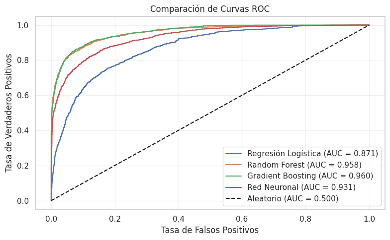
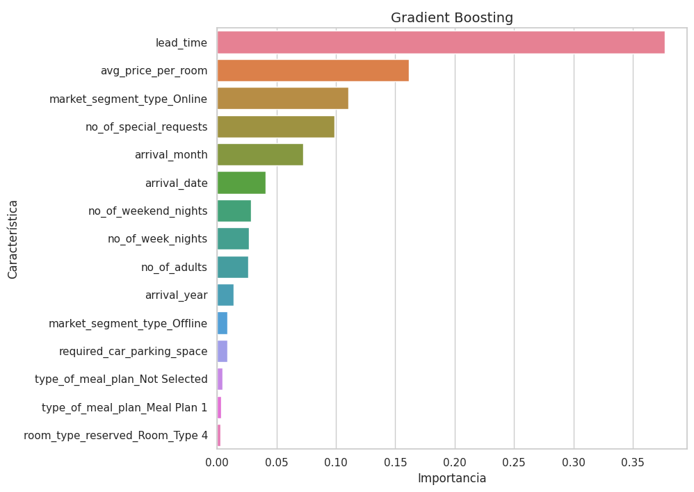
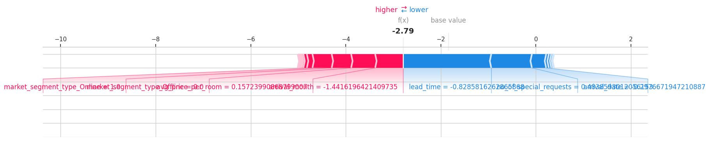

# Modelo de clasificación para la prediccion de cancelaciones de reservas de hotel

## Pregunta de investigación
¿Es posible predecir la cancelación de una reserva de hotel basándose en las
características de la reserva y del cliente?

### Objetivo General
Desarrollar un modelo predictivo que estime la probabilidad de cancelación de una
reserva de hotel.

### Objetivos Específicos

- Realizar un análisis exploratorio de los datos para identificar patrones y
    relaciones relevantes.
- Seleccionar y aplicar técnicas de preprocesamiento adecuadas para preparar los
    datos.
- Entrenar y evaluar diferentes modelos de clasificación para determinar el más
    efectivo.

### Datos para desarrollar el proyecto y análisis previo

El conjunto de datos contiene 19 variables independientes (X) y una variable
dependiente (Y), booking_status, que indica si una reserva fue cancelada (1) o no (0).
Este archivo, en formato CSV, fue obtenido de la plataforma Kaggle y está compuesto
por información estructurada sobre clientes, características de la reserva, historial del
cliente y detalles contextuales como el segmento de mercado o el tipo de habitación
solicitada.

#### Descripción de variables

| Variable | Tipo | Descripción |
|----------|------|-------------|
| Booking_ID | Numérica | Identificador único de la reserva (no usado en el modelo) |
| no_of_adults | Numérica | Número de adultos en la reserva |
| no_of_children | Numérica | Número de niños en la reserva |
| no_of_weekend_nights | Numérica | Número de noches de fin de semana (sábado/domingo) de la estancia |
| no_of_week_nights | Numérica | Número de noches entre semana de la estancia |
| required_car_parking_space | Numérica | Indica si se requiere espacio de estacionamiento (0: No, 1: Sí) |
| lead_time | Numérica | Número de días entre la fecha de reserva y la fecha de llegada |
| arrival_year | Numérica | Año de llegada |
| arrival_month | Numérica | Mes de llegada |
| arrival_date | Numérica | Día del mes de llegada |
| repeated_guest | Numérica | Indica si el cliente es un huésped repetido (0: No, 1: Sí) |
| no_of_previous_cancellations | Numérica | Número de reservas previas canceladas por el cliente |
| no_of_previous_bookings_not_canceled | Numérica | Número de reservas previas no canceladas por el cliente |
| avg_price_per_room | Numérica | Precio promedio por día de la reserva |
| no_of_special_requests | Numérica | Número de solicitudes especiales hechas por el cliente |
| type_of_meal_plan | Categórica | Tipo de plan de comidas seleccionado |
| room_type_reserved | Categórica | Tipo de habitación reservada |
| market_segment_type | Categórica | Segmento de mercado de la reserva (p.ej., Online, Offline, Corporate) |
| booking_status | Categórica (Target) | Estado de la reserva (1: Cancelada, 0: No Cancelada) |

El análisis exploratorio de datos (EDA) reveló los siguientes hallazgos importantes:

1. **Distribución de la variable objetivo**: Existe un desbalance en los datos, con un 32.76% de reservas canceladas frente a un 67.24% de reservas no canceladas.
   

2. **Variables con mayor correlación con la cancelación**:
   - lead_time (0.4385): A mayor tiempo entre la reserva y la llegada, mayor probabilidad de cancelación.
   - avg_price_per_room (0.1426): A mayor precio promedio por habitación, mayor probabilidad de cancelación.
   - no_of_special_requests (-0.2531): A más solicitudes especiales, menor probabilidad de cancelación.
   - repeated_guest (-0.1073): Los huéspedes repetidos tienden a cancelar menos.
   

3. **Patrones por segmento de mercado**: El segmento "Online" muestra la mayor tasa de cancelación (36.51%), seguido por "Offline" (29.95%) y "Aviation" (29.60%), mientras que "Corporate" (10.91%) y "Complementary" (0%) presentan tasas significativamente menores.
   

4. **Estacionalidad**: Se observan variaciones significativas en las tasas de cancelación por mes, con picos en los meses de verano: julio (45.00%), junio (40.31%) y agosto (39.02%). Los meses con menor tasa de cancelación son diciembre (13.31%) y enero (2.37%).
   

5. **Planes de comida**: Las reservas con "Meal Plan 2" tienen la mayor tasa de cancelación (45.57%), seguidas por "Not Selected" (33.12%) y "Meal Plan 1" (31.18%), mientras que "Meal Plan 3" muestra la menor tasa (20.00%), aunque este último tiene muy pocas observaciones (5 en total).
   

Gráficamente, el precio promedio por habitación (gráfica de cajas y bigotes) muestra una ligera diferencia entre reservas canceladas (media: 110.59, mediana: 108.0) y no canceladas (media: 99.93, mediana: 95.0), con una correlación positiva de 0.1426. Un mapa de calor de correlaciones numéricas permitió identificar relaciones potencialmente útiles para el modelo, destacando que las variables con mayor correlación con la variable objetivo son lead_time (0.4385), no_of_special_requests (-0.2531), avg_price_per_room (0.1426) y repeated_guest (-0.1073).

Estos hallazgos sugieren que es factible entrenar un modelo de clasificación
supervisado capaz de estimar la probabilidad de cancelación con base en las variables
disponibles y se considera que los datos se encuentran en buenas condiciones para
iniciar el proceso de entrenamiento y validación de modelos. Para la transformación de los datos en las variables numéricas se contempla realizar un
estándar scaler para evitar posibles efectos de las magnitudes de las variables en el
entrenamiento de los modelos, para las variables categóricas se utilizará un One-hot
encoder. De acuerdo a la gráfica de la distribución de la variable
objetivo(booking_status) se ha confirmado un desbalance (32.73% canceladas vs 67.27% no canceladas) por lo cual se emplearán técnicas como SMOTE o ajuste de pesos para balancear el conjunto de datos y evitar sesgos en el entrenamiento del
modelo.

### Metodología de investigación

Para abordar la predicción de cancelaciones de reservas de hotel, se seguirá una metodología estructurada de aprendizaje automático:

1. **Preprocesamiento de datos**:
   - Normalización de variables numéricas mediante StandardScaler
   - Codificación de variables categóricas mediante One-Hot Encoding
   - Tratamiento del desbalance de clases mediante técnicas de ponderación de clases
   - División del conjunto de datos en entrenamiento (80%) y prueba (20%)

2. **Selección y entrenamiento de modelos**:
   - Se evaluarán los siguientes algoritmos:
     - Regresión Logística (como línea base)
     - Random Forest
     - Gradient Boosting
   - Para cada modelo se utilizará validación cruzada con k=5 pliegues para evaluar su rendimiento
   
3. **Evaluación y comparación de modelos**:
   - Métricas principales: AUC-ROC, precisión, recall, F1-score
   - Análisis de la curva ROC y matriz de confusión
   - Interpretación de feature importance para los modelos basados en árboles
   
4. **Ajuste de hiperparámetros**:
   - Optimización mediante Grid Search o Random Search para los modelos con mejor desempeño inicial
   - Reevaluación con el conjunto de prueba

### Preprocesamiento de datos

Siguiendo la metodología propuesta, se realizó el preprocesamiento de los datos para su posterior modelado:

1. **Verificación de valores nulos**: Se confirmó que el conjunto de datos no presenta valores nulos, lo que simplifica el proceso de preparación.

2. **Identificación de variables**: Se identificaron 14 variables numéricas y 3 variables categóricas relevantes para el análisis, excluyendo el identificador único (Booking_ID) que no aporta valor predictivo.

3. **División de datos**: El conjunto de datos se dividió en entrenamiento (80%) y prueba (20%), manteniendo la misma distribución de la variable objetivo en ambos conjuntos (32.76% de reservas canceladas).

4. **Transformación de variables**:
   - Las variables numéricas se normalizaron mediante StandardScaler para evitar que la escala de cada variable influya desproporcionadamente en el modelo.
   - Las variables categóricas se transformaron utilizando OneHotEncoder para convertirlas en un formato adecuado para los algoritmos de machine learning.

5. **Manejo del desbalance de clases**: Se identificó un desbalance en la variable objetivo, con un ratio de 2.05:1 entre reservas no canceladas y canceladas. Para abordar este desbalance, se optará por utilizar la técnica de ponderación de clases (class_weight='balanced') en los modelos y evaluar su rendimiento mediante métricas adecuadas como AUC-ROC.

Tras el preprocesamiento, los datos están listos para la fase de modelado, que incluirá la evaluación de diferentes algoritmos de clasificación.

### Modelado y evaluación

Se entrenaron tres algoritmos de clasificación: Regresión Logística como línea base, Random Forest y Gradient Boosting. Cada modelo fue optimizado mediante validación cruzada y búsqueda de hiperparámetros (GridSearchCV).

Los resultados mostraron un desempeño superior de los algoritmos basados en ensambles de árboles:

| Modelo              | Accuracy | Precision | Recall | F1-Score | ROC AUC |
|---------------------|----------|-----------|--------|----------|---------|
| Regresión Logística | 0.7859   | 0.6438    | 0.7762 | 0.7038   | 0.8711  |
| Random Forest       | 0.9031   | 0.8642    | 0.8355 | 0.8496   | 0.9577  |
| Gradient Boosting   | 0.9017   | 0.8778    | 0.8132 | 0.8443   | 0.9590  |

El modelo de Gradient Boosting obtuvo el mejor resultado en términos de ROC AUC (0.9590), lo que indica su capacidad superior para discriminar entre reservas que serán canceladas y las que no.

El análisis de importancia de características confirmó los hallazgos del EDA: el tiempo de anticipación (`lead_time`) es el predictor más importante, seguido por el precio promedio por habitación (`avg_price_per_room`), el número de solicitudes especiales (`no_of_special_requests`) y el segmento de mercado, especialmente "Online".

Estos resultados confirman que es posible predecir con alta precisión la probabilidad de cancelación de una reserva hotelera basándose en sus características, lo que permite a los hoteles implementar estrategias proactivas para mitigar el impacto económico de las cancelaciones.

### Interpretabilidad del modelo con SHAP

Para proporcionar una comprensión más profunda de las decisiones del modelo y hacerlo más interpretable para los usuarios finales, se implementó el análisis SHAP (SHapley Additive exPlanations). Esta técnica permite entender cómo cada característica contribuye a las predicciones individuales y al comportamiento global del modelo.

#### Importancia global de características

El análisis SHAP confirmó que el tiempo de anticipación (`lead_time`) es la característica más influyente en la predicción de cancelaciones, con un valor de importancia promedio de 1.5911. Las solicitudes especiales (`no_of_special_requests`) ocupan el segundo lugar con 1.0654, seguidas por el precio promedio por habitación (`avg_price_per_room`) con 0.8519, el mes de llegada (`arrival_month`) con 0.5691 y el segmento de mercado online (`market_segment_type_Online`) con 0.5556.

En el gráfico de resumen SHAP, se observa que:
- Valores altos de `lead_time` tienen un impacto positivo significativo en la probabilidad de cancelación.
- Un bajo número de solicitudes especiales aumenta la probabilidad de cancelación.
- Precios más altos por habitación tienden a asociarse con más cancelaciones.
- Ciertos meses de llegada tienen un impacto variable pero significativo.
- Las reservas del segmento "Online" muestran una mayor tendencia a ser canceladas.

#### Análisis de dependencia

El análisis de dependencia SHAP para `lead_time` revela una relación no lineal pero claramente positiva entre el tiempo de anticipación y la probabilidad de cancelación. A medida que el `lead_time` aumenta, su contribución a la predicción de cancelación se incrementa significativamente, especialmente a partir de valores normalizados superiores a 0.

Esta relación no es simplemente lineal, sino que muestra un patrón donde:
- Reservas con muy poco tiempo de anticipación tienen una baja probabilidad de cancelación.
- Existe un umbral intermedio donde la probabilidad aumenta moderadamente.
- Reservas hechas con mucha anticipación (valores normalizados > 1) muestran un marcado aumento en la probabilidad de cancelación.

#### Explicaciones individuales

Los diagramas de fuerza SHAP nos permiten entender por qué el modelo predice cancelación o no cancelación para casos específicos. Por ejemplo:

**Caso de una reserva cancelada**:
- Un bajo número de solicitudes especiales (valor=-0.7893) aumenta la probabilidad de cancelación (SHAP=0.9839).
- Un precio promedio por habitación bajo (valor=-0.8643) disminuye la probabilidad (SHAP=-0.8307).
- Pertenecer al segmento de mercado "Online" (valor=1.0000) aumenta la probabilidad (SHAP=0.6943).
- Un alto número de noches entre semana (valor=4.1176) aumenta la probabilidad (SHAP=0.5333).

**Caso de una reserva no cancelada**:
- Un bajo tiempo de anticipación (valor=-0.8286) disminuye significativamente la probabilidad de cancelación (SHAP=-1.5277).
- La presencia de solicitudes especiales (valor=0.4839) también reduce la probabilidad (SHAP=-0.6453).
- El mes de llegada y el segmento de mercado tienen efectos contrapuestos en este caso particular.

Estos resultados SHAP no solo validan los hallazgos del análisis exploratorio inicial, sino que proporcionan una comprensión mucho más detallada de cómo las diferentes variables interactúan para influir en la probabilidad de cancelación, tanto a nivel global como en casos individuales. Esta interpretabilidad es crucial para que los hoteles puedan implementar estrategias efectivas basadas en las predicciones del modelo.

### Conclusiones y recomendaciones

Este proyecto ha demostrado que es posible predecir con alta precisión (90.17% de exactitud) la cancelación de reservas hoteleras utilizando técnicas de aprendizaje automático. El modelo Gradient Boosting seleccionado alcanzó un AUC-ROC de 0.959, indicando una excelente capacidad para distinguir entre reservas que serán canceladas y las que no.

Los hallazgos más importantes derivados tanto del análisis exploratorio como de la modelación e interpretación con SHAP son:

1. **Factores determinantes de cancelación**:
   - El tiempo transcurrido entre la reserva y la fecha de llegada (`lead_time`) es el predictor más importante, con una relación directamente proporcional a la probabilidad de cancelación.
   - Las solicitudes especiales actúan como un "compromiso" del cliente con su estadía, reduciendo significativamente la probabilidad de cancelación.
   - Los precios más altos están asociados con mayores tasas de cancelación, sugiriendo una mayor sensibilidad al precio en reservas costosas.
   - Los segmentos de mercado "Online" y "Offline" presentan tasas de cancelación sustancialmente mayores que segmentos como "Corporate".
   - Existe una marcada estacionalidad, con picos de cancelación en los meses de verano (junio, julio y agosto).

2. **Recomendaciones estratégicas para hoteles**:
   - **Políticas de cancelación diferenciadas**: Implementar políticas de cancelación escalonadas según el tiempo de anticipación de la reserva, con condiciones más restrictivas para reservas realizadas con mucha antelación.
   - **Fomento de solicitudes especiales**: Incentivar a los clientes a realizar solicitudes especiales como parte del proceso de reserva, ya que esto funciona como indicador de compromiso.
   - **Revisión de estrategias de precios**: Analizar el impacto de los precios en las cancelaciones, posiblemente implementando ofertas especiales para reservas con alta probabilidad de cancelación.
   - **Estrategias específicas por segmento**: Desarrollar estrategias diferenciadas para segmentos de mercado con alto riesgo, como ofrecer beneficios adicionales o solicitar depósitos para reservas online.
   - **Planificación estacional**: Ajustar estrategias de overbooking y gestión de inventario según la temporada, siendo más conservadores en meses con bajas tasas de cancelación.

3. **Aplicaciones prácticas del modelo**:
   - **Sistema de scoring de riesgo**: Implementar un sistema que clasifique automáticamente las nuevas reservas en categorías de riesgo (bajo, medio, alto) para facilitar decisiones operativas.
   - **Optimización de overbooking**: Utilizar las predicciones para calibrar estrategias de overbooking, maximizando la ocupación sin comprometer la experiencia del cliente.
   - **Intervenciones personalizadas**: Identificar reservas con alta probabilidad de cancelación para realizar intervenciones proactivas como ofertas especiales o servicios adicionales.

Este modelo predictivo representa una herramienta valiosa para la gestión hotelera, permitiendo anticipar cancelaciones y mitigar su impacto económico. La implementación de las estrategias sugeridas podría traducirse en mejoras significativas en la rentabilidad, ocupación y satisfacción del cliente.

### Trabajo futuro

Como líneas de investigación futuras, se propone:

1. **Ampliación del modelo**: Incorporar variables adicionales como condiciones meteorológicas, eventos locales o indicadores económicos que podrían mejorar aún más la precisión de las predicciones.

2. **Modelos específicos por segmento**: Desarrollar modelos especializados para diferentes segmentos de mercado o temporadas, que podrían capturar patrones más específicos.

3. **Impacto financiero**: Realizar un análisis cuantitativo del impacto económico de las cancelaciones y el beneficio potencial de implementar las estrategias recomendadas.

4. **Interfaz de usuario**: Desarrollar una interfaz intuitiva que permita al personal hotelero utilizar el modelo para tomar decisiones informadas en tiempo real.

5. **Actualización continua**: Implementar un sistema de actualización periódica del modelo para adaptarse a cambios en los patrones de comportamiento de los clientes.

### Revisión de la literatura y estado del arte

La predicción de cancelaciones de reservas hoteleras ha sido ampliamente estudiada en la literatura reciente debido a su impacto directo en la rentabilidad y gestión operativa de los hoteles. 

Antonio et al. (2017) demostraron que modelos de machine learning como Random Forest pueden predecir cancelaciones con una precisión superior al 80%, identificando variables como el tiempo de anticipación (lead time) y el tipo de tarifa como predictores clave.

Por su parte, Morales et al. (2019) compararon diversos algoritmos de clasificación, encontrando que los modelos de Gradient Boosting ofrecían los mejores resultados al capturar interacciones complejas entre variables como la temporada, el segmento de mercado y el historial del cliente.

Este proyecto se apoya en estos trabajos previos, adaptando sus metodologías al contexto específico de nuestro conjunto de datos y ampliando la interpretabilidad de los resultados para generar recomendaciones accionables.

### Plan

**AQUÍ INCLUIR DIAGRAMA GANTT O PERT DEL PROYECTO**

El proyecto se desarrollará siguiendo el siguiente cronograma:

- Semana 1: Análisis exploratorio de datos y comprensión del problema
- Semana 2: Preprocesamiento de datos y preparación para el modelado
- Semana 3: Entrenamiento y evaluación de modelos base
- Semana 4: Optimización de hiperparámetros y selección del modelo final
- Semana 5: Interpretación de resultados y documentación final

### Plan

Este proyecto se ejecutará en un período de seis semanas, siguiendo un plan estructurado que garantice la consecución de cada uno de los objetivos planteados. A continuación, se detalla el cronograma de actividades y sus dependencias:

**Fase 1: Definición del problema y recolección de datos (Semana 1)**
- Definición de la pregunta de investigación y objetivos (3 días)
- Búsqueda y obtención del conjunto de datos (2 días)
- Exploración inicial del conjunto de datos (2 días)

**Fase 2: Análisis exploratorio de datos (Semana 2)**
- Análisis de distribuciones univariantes (2 días)
- Análisis de correlaciones entre variables (2 días)
- Visualización de patrones por segmentos de mercado (1 día)
- Análisis temporal y estacional (1 día)
- Documentación de hallazgos del EDA (1 día)

**Fase 3: Preprocesamiento de datos (Semana 3)**
- Tratamiento de valores nulos y outliers (1 día)
- Normalización de variables numéricas (1 día)
- Codificación de variables categóricas (1 día)
- División en conjuntos de entrenamiento y prueba (1 día)
- Preparación para el modelado (1 día)

**Fase 4: Modelado y evaluación (Semana 4)**
- Entrenamiento del modelo base (Regresión Logística) (1 día)
- Entrenamiento de modelos avanzados (Random Forest, Gradient Boosting) (2 días)
- Evaluación y comparación de modelos (1 día)
- Ajuste de hiperparámetros (2 días)
- Selección del mejor modelo (1 día)

**Fase 5: Interpretabilidad y explicación (Semana 5)**
- Análisis de importancia de características (1 día)
- Implementación de SHAP para interpretabilidad (2 días)
- Análisis de predicciones individuales (1 día)
- Documentación de insights del modelo (1 día)

**Fase 6: Documentación y entrega final (Semana 6)**
- Redacción del informe final (2 días)
- Creación de visualizaciones para presentación (1 día)
- Preparación de recomendaciones prácticas (1 día)
- Revisión y finalización del documento (1 día)
- Entrega final (1 día)

Este cronograma considera las dependencias entre actividades, permitiendo un flujo de trabajo eficiente y la adaptación a posibles desafíos que surjan durante la ejecución del proyecto.

### Implicaciones éticas

La implementación de un sistema predictivo de cancelaciones hoteleras conlleva consideraciones éticas importantes:

1. **Privacidad de datos**: El modelo utiliza información personal de los clientes, lo que exige un manejo responsable y conforme a regulaciones como GDPR o leyes locales de protección de datos.

2. **Discriminación algorítmica**: Existe el riesgo de que el modelo aprenda patrones discriminatorios basados en características como la nacionalidad o el tipo de mercado, por lo que se debe monitorear y mitigar cualquier sesgo en las predicciones.

3. **Transparencia con los clientes**: Los hoteles deben ser transparentes sobre el uso de estos sistemas predictivos y cómo pueden afectar políticas como depósitos o restricciones de cancelación.

4. **Impacto laboral**: La automatización de decisiones basadas en estas predicciones podría afectar a empleados en roles de gestión de reservas, requiriendo potencialmente su reentrenamiento o reasignación.

### Aspectos legales y comerciales

#### Potencial comercial

El modelo predictivo desarrollado en este proyecto presenta múltiples oportunidades de aplicación comercial que podrían traducirse en beneficios económicos significativos para la industria hotelera:

1. **Optimización de ingresos**: El uso de estrategias de overbooking controlado basadas en predicciones precisas podría aumentar los ingresos entre un 2% y 5% anual, según estimaciones de la industria. Por ejemplo, un hotel de 100 habitaciones con una tarifa media de $100 podría incrementar sus ingresos en aproximadamente $73,000-$182,500 anuales.

2. **Reducción de costos operativos**: La previsión precisa de ocupación permite optimizar la gestión de personal y recursos, reduciendo costos operativos entre un 3% y 7%. Esto incluye planificación eficiente de personal, gestión de inventarios y servicios de restauración.

3. **Sistema de pricing dinámico**: La integración con sistemas de precios dinámicos permitiría ajustar tarifas en tiempo real según la probabilidad de cancelación, maximizando el RevPAR (Revenue Per Available Room) hasta en un 10%.

4. **Modelo SaaS para cadenas hoteleras**: El modelo podría comercializarse como solución software-as-a-service, con un potencial modelo de suscripción basado en el número de habitaciones o reservas procesadas mensualmente. Para una cadena mediana de 10-20 hoteles, esto podría representar una suscripción de $2,000-$5,000 mensuales.

5. **Consultoría estratégica**: Oportunidad de ofrecer servicios de consultoría para la implementación del modelo y el desarrollo de estrategias personalizadas para cada propiedad, generando una línea de negocio adicional.

#### Marco legal

La implementación de un sistema predictivo para cancelaciones de reservas debe contemplar un marco legal riguroso, particularmente en lo referente a:

1. **Leyes de protección de datos**:
   - **GDPR en Europa**: Cumplimiento con el Reglamento General de Protección de Datos que exige consentimiento explícito, derecho al olvido y portabilidad de datos.
   - **LGPD en Brasil**: Similar al GDPR, exige bases legales para el tratamiento de datos y derechos específicos para los titulares.
   - **CCPA/CPRA en California**: Otorga a los consumidores derechos sobre sus datos personales y exige transparencia en la recopilación y uso.
   - **Ley 1581 de 2012 en Colombia**: Establece disposiciones generales para la protección de datos personales y habeas data.

2. **Prácticas comerciales justas**:
   - Las políticas diferenciadas basadas en predicciones algorítmicas deben cumplir con las leyes antimonopolio y de competencia desleal.
   - Se deben evitar prácticas discriminatorias que puedan infringir leyes de igualdad y derechos del consumidor.
   - Las condiciones especiales aplicadas a reservas con alta probabilidad de cancelación deben ser transparentes y justificables.

3. **Transparencia y comunicación**:
   - Los términos y condiciones deben incluir información clara sobre cómo se utilizan los datos para hacer predicciones.
   - Se debe informar a los clientes sobre las políticas derivadas del modelo predictivo, evitando sorpresas desagradables.
   - Es recomendable tener políticas de cancelación escalonadas claramente comunicadas en el momento de la reserva.

4. **Almacenamiento de datos**:
   - Los datos utilizados para entrenar y aplicar el modelo deben almacenarse en servidores que cumplan con los estándares de seguridad de la industria (como ISO 27001).
   - Se deben implementar políticas de retención de datos que limiten el tiempo de almacenamiento según las necesidades legítimas del negocio.
   - Es necesario establecer procesos claros para responder a solicitudes de acceso, rectificación o eliminación de datos personales.

## Bibliografía

Antonio, N., de Almeida, A., & Nunes, L. (2017). Predicting hotel booking cancellations to decrease uncertainty and increase revenue. Tourism & Management Studies, 13(2), 25-39. https://doi.org/10.18089/tms.2017.13203

Morales, D. R., & Wang, J. (2019). Forecasting cancellation rates for services booking by modelling exogenous factors. International Journal of Forecasting, 35(1), 307-322. https://core.ac.uk/download/pdf/288283676.pdf

Chatziladas, R. (2021). Predicting hotel booking demand and cancellations using machine learning and comparison of feature importance. Thesis submitted in partial fulfillment of the requirements for the degree of Master of Science in Data Science & Society, School of Humanities and Digital Sciences, Tilburg University. https://arno.uvt.nl/show.cgi?fid=180514

Shrestha, A., & Jeong, S. R. (2020). Predicting hotel cancellation with class imbalance using SMOTE and random forest. Sustainability, 12(19), 8043. https://www.mdpi.com/2227-9717/9/10/1713

Fernández-Torres, Y., Gutiérrez-Barroso, J., & Lorenzo-Alegría, R. (2019). Machine Learning models applied to hotel booking cancellation. An opportunity for businesses and research. International Journal of Scientific Management and Tourism, 5(1), 3-33.

Schwartz, Z., Uysal, M., Webb, T., & Altin, M. (2016). Hotel daily occupancy forecasting with competitive sets: a recursive algorithm. International Journal of Contemporary Hospitality Management, 28(2), 267-285. https://doi.org/10.1108/IJCHM-10-2014-0507